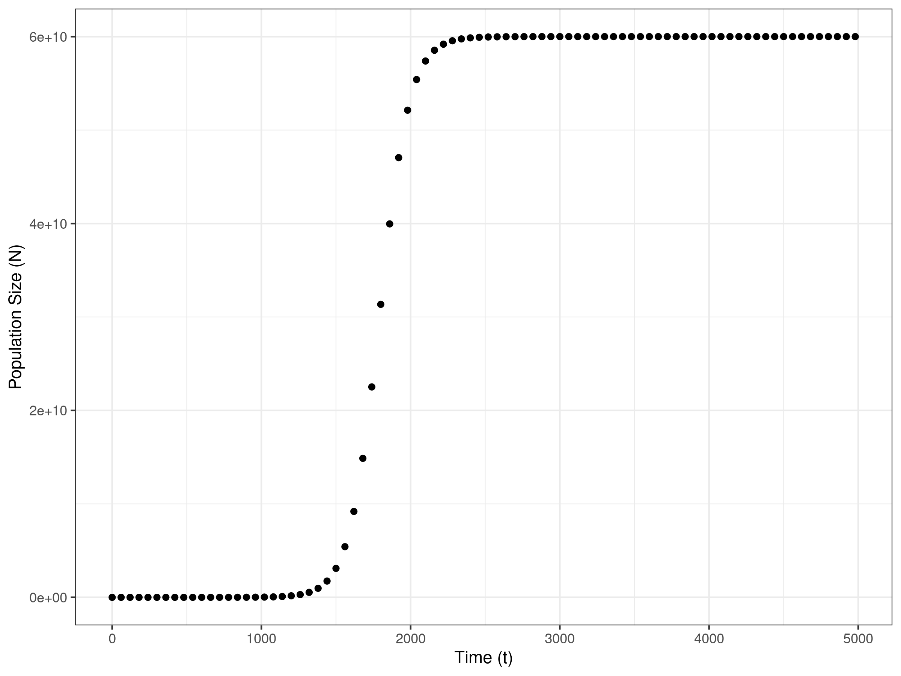
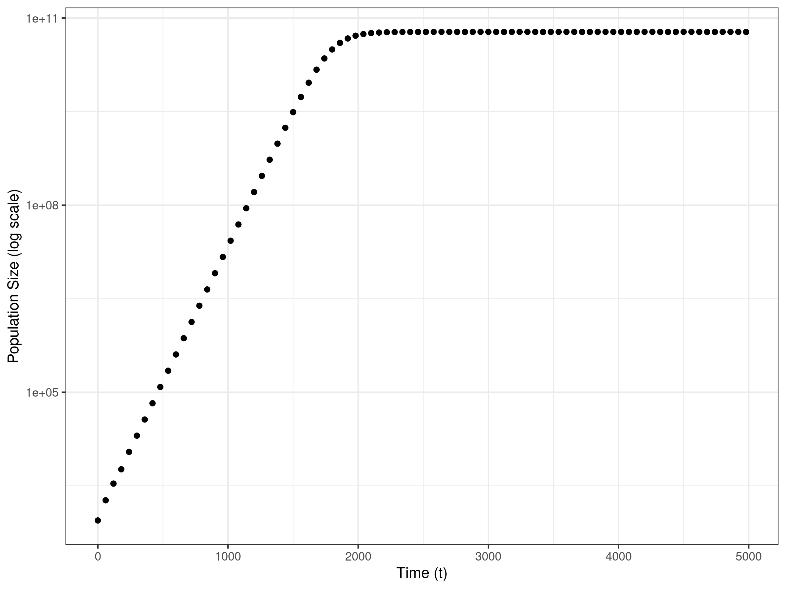
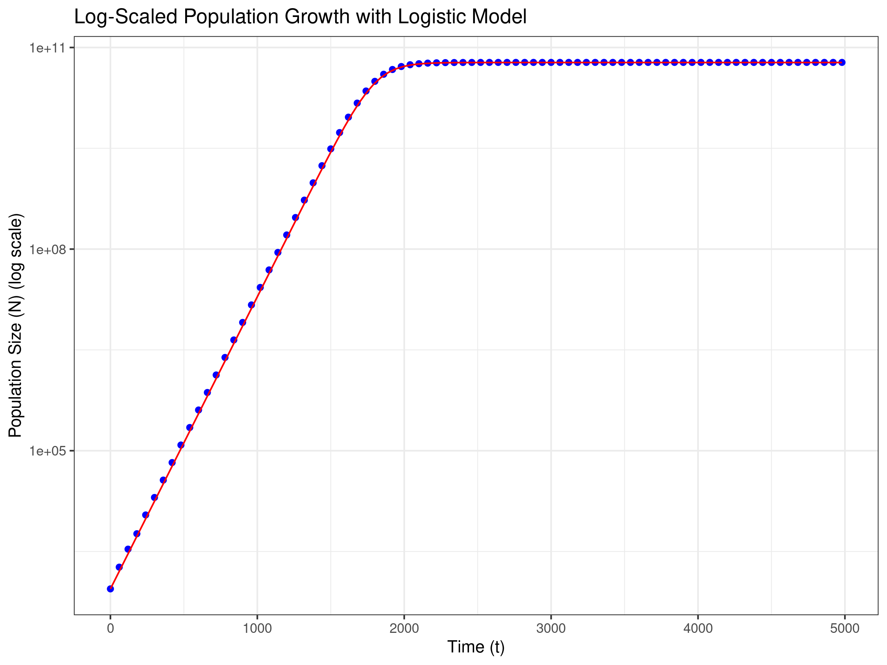
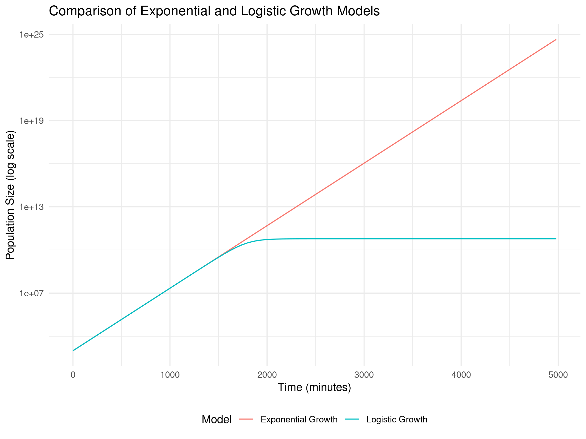

# Logistic Growth
## Question 1
- Logistic growth models are used to describe population growth in environments with limited resources.
- Experimental set up: 900 μl of growth medi and 100 μl suspended bacterium Escherichia coli in the same media.
- Under the logistic growth model, the bacteria will start multiplying at a fast rate as there is lots of resources available.
- This will continue until resources start to become limited. 
- Therefore, growth rate will start to decrease.
- The population size will reach its carrying capacity (K) (the maximum population size an environment can sustain).

### Graphical representation of Data

- Plot of the raw data with time (mins) on the x axis and population size (N) on the y axis.
- This graph has the charectrisitc sigmodial curve, showing exponetial population growth at the start, which slows and then reaches the carrying capacity.
  

- Plot of a semi-log plot with time (mins) on the x axis and population size (N) on the y axis as a logarithmic scale.
- By transforming population size, there is now a linear relationship between population and time.
- As such the graph now shows an increasing linear relationship at the start, which then becomes constant.

### Observation
**1. When K is much greater than N0 and t is small, the population grows exponentially.**

- Therefore, 

$$
N(t) = \frac{K N_0 e^{rt}}{K - N_0 + N_0 e^{rt}} \quad\to\quad \ln(N) = \ln(N_0) + rt
$$

- Therefore,
- As r = 0.0100086 - Calculated by fitting a linear model to log-transformed N to approximate early growth rate approximation when K >> N0 and t (1500)

$$
ln(N_0) = 6.8941709 
$$

- So,
  
$$
N_0 = 986.51
$$

**2. When t tends towards infinity N(t) → K**

- Therefore, 
- When t is large (2000) and assuming the population size remains constant using a linear model. 

$$
N(t) = K + 0*t
$$

$$
(K) = 5.979 x 1010
$$

### Assessing model fit
- The graph shows the linear model using estimates fitted to the actual growth data.
- The blue dots show the actual growth data, while the red line represents the model.
- The graph, shows that the model has a very good fit to the data, therefore, our estimate parameters are appropriate.
  

### Results
**Parameters** 
- N0 = 986.51
- r =  0.0100086
- K = 5.979 x 1010
- This is a model of density-dependent regulation, where growth rate decreases as population size increases, reflecting real-world limits on resources.

## Question 2
### Set Parameters 
- N0 = 986.51
- r =  0.0100086
- K = 5.979 x 1010
- When t = 4980

### Calculate
1. The exponential growth model formula is:

$$
N(t) = N_0 e^{rt}
$$

- Exponential Growth Prediction: **N = 4.37 x 1024**

2. The logistic growth model formula is:

$$
N(t) = \frac{K N_0 e^{rt}}{K - N_0 + N_0 e^{rt}}
$$

- Using K = 5.979 x 1010
- Logistic Growth Prediction: **N = 5.979 x 1010**

### Comparison
- The exponential growth model predicts (N = 4.37 x 1024) an greater population size, exceeding the carrying capacity (N = 5.979 x 1010)
- However, the logistic growth model accounts for resource limitations.
- Therefore, the population stabilizes (N = 5.979 x 1010) which is much more realistic.
- Comapring the two models highlights that an exponential model is not realistic to an enviorment with limited resources, therefore logistic growth is more appropriate in this setting.

## Question 3
- Code can be found in Question 3.R in repository 

### Interpretations
Orange represent exponential growth - As on a log scale it is a straight line
- This shows continuous and unbounded increase, suggesting no constraints on resources or space.

Blue line represents logistic growth - as levels off at a particular value as population reaches carrying capacity.
- This suggests a maximum population size due to environmental constraints.

My graph shows unrestricted growth (exponential) and limited growth stabilising at a sustainable level (logistic).

