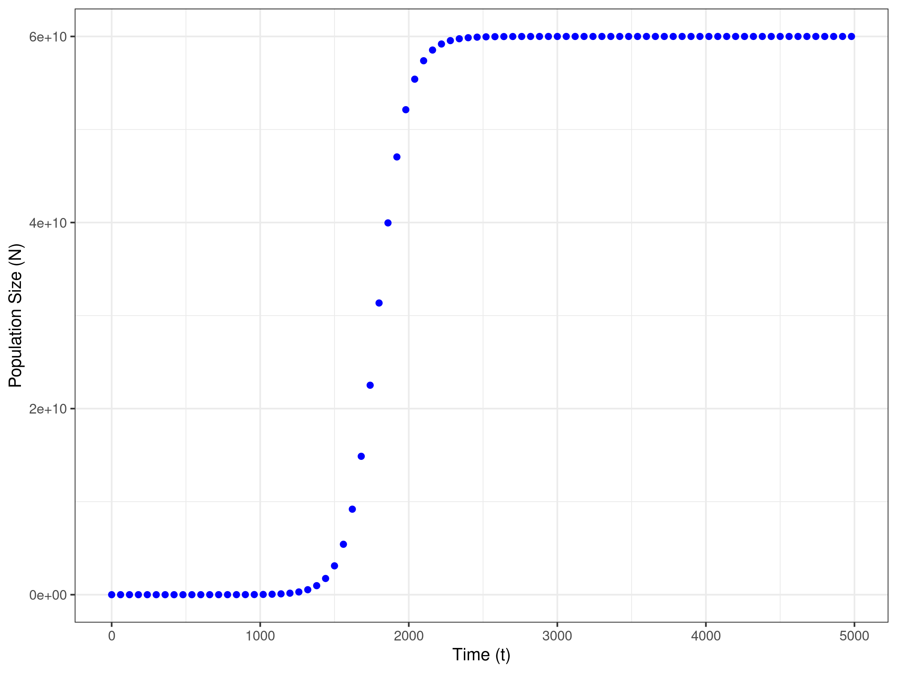
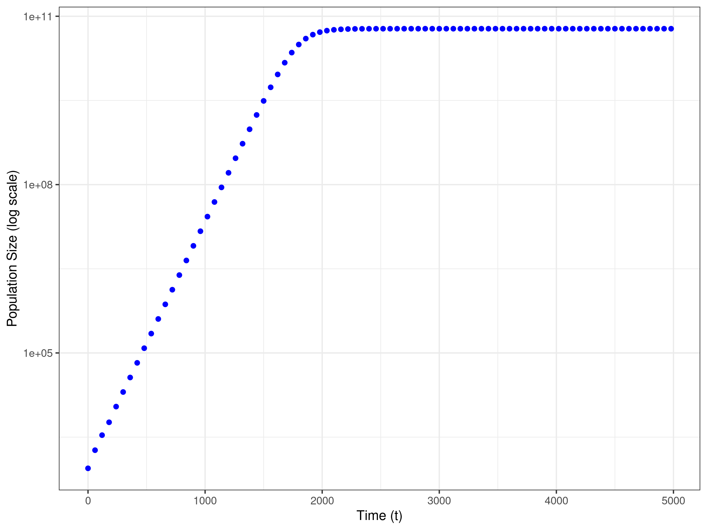

# Logistic Growth
## Question 1
- Logistic growth models are used to describe population growth in environments with limited resources.
- Experimental set up: 900 μl of growth medi and 100 μl suspended bacterium Escherichia coli in the same media.
- Under the logistic growth model, the bacteria will start multiplying at a fast rate as there is lots of resources available.
- This will continue until resources start to become limited. 
- Therefore, growth rate will start to decrease.
- The population size will reach its carrying capacity (K) (the maximum population size an environment can sustain).

### Graphical representation of Data
 
- This plot of my raw dat shows exponetial population growth at the start, which slows and then reaches the carrying capacity. 

- I have now log-transformed the y-axis to show an increasing linear relationship at the start, which then becomes constant.

### Observation
1. When K is much greater than N0 and t is small, the population grows exponentially.
2. When t tends towards infinity N(t) → K

### Estimates 
- Using my observations I can estimate the values of N0, r and k using a linear approximation.
- The initial population size **at time t = 0 was N0 = 879** - Value taken from excel data (named Experiment.csv)
- The intrinsic rate of growth (r) (growth rate in an ideal environment (i.e., no resource limitation) **r = 0.0100086** - Calculated fitting a linear model to log-transformed N to approximate early growth rate approximation when K >> N0 and t (1500)
- The carrying capacity **(K) = 5.979e+10** - Calculated when t is large (2000) and assuming the population size remains constant using a linear model. 

### Interpretations
- The population reaches a point near the carrying capacity, and growth nearly stops as the population stabilizes.
- In the provided data, this is evident around t =2000 when N(t) approaches K closely.
- This is a model of density-dependent regulation, where growth rate decreases as population size increases, reflecting real-world limits on resources.

## Question 2
### Set Parameters 
- N0 = 879
- r =  0.0100086
- When t = 4980

### Calculate
- The exponential growth model formula is: N(t) = N0ert
- Exponential Growth Prediction: N = 3.894521e+24

- The logistic growth model formula is:
- N(t) = (N0 * K * ert) / (K + (N0 * (ert - 1)))
- Using K = 5.979 x 1010
- Logistic Growth Prediction: N = 5.979e+10

### Comparison
- The exponential growth model predicts (N = 3.894521e+24) an greater population size, exceeding the carrying capacity (5.979 x 1010)
- However, the logistic growth model accounts for resource limitations.
- Therefore, the population stabilizes (N = 5.979e+10) which is much more realistic.
- Comapring the two models it highlights that an exponential model is not realistic to an enviorment with limited resources, therefore logistic growth is more appropriate in this setting.

## Question 3
https://github.com/deepminer142/logistic_growth/blob/3912ce3b9c63229fac5b3f4748c96a0a38741bc6/Question%203.R#L1-L34

### Interpretations
Blue represent exponential growth - As on a log scale it is a straight line
- This shows continuous and unbounded increase, suggesting no constraints on resources or space.
Red line represents logistic growth - as levels off at a particular value as population reaches carrying capacity.
- This suggests a maximum population size due to environmental constraints.

My graph shows unrestricted growth (exponential) and limited growth stabilising at a sustainable level (logistic).

