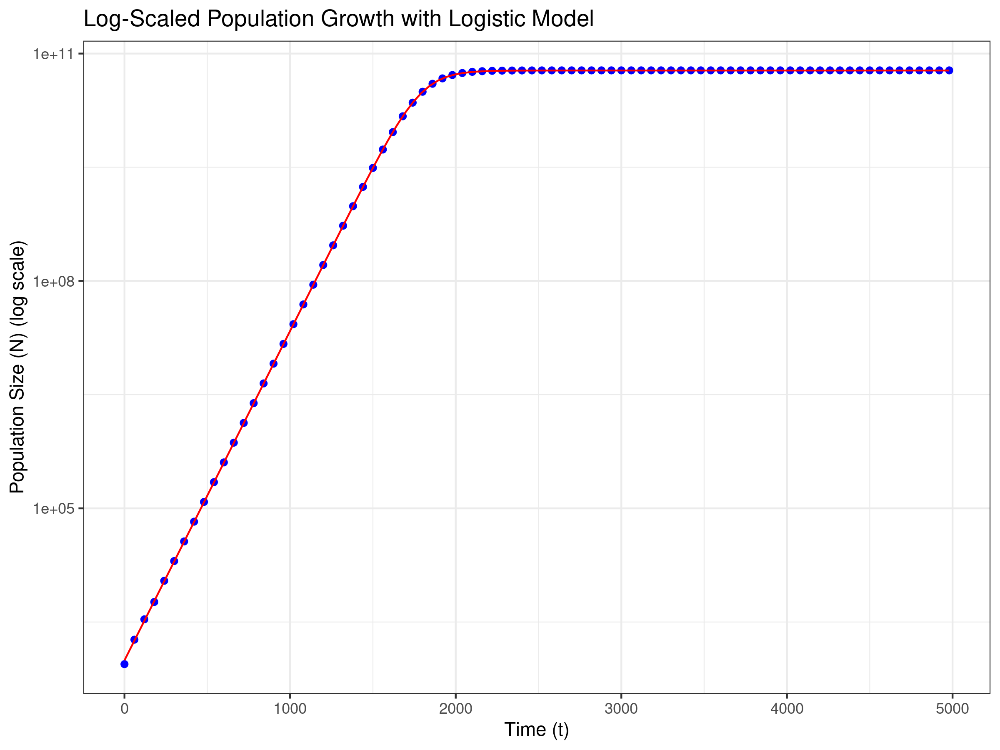

# Logistic Growth

## Question 1
### Introduction 
Logistic growth models are used to describe population growth in environments with limited resources. This report examines bacterial growth in an experimentally controlled environment. A total of 900 μl of growth media and 100 μl of the bacterium Escherichia coli were suspended in the same media. It is hypothesized that, under the logistic growth model, the bacteria will initially multiply rapidly due to the abundance of resources. This growth will continue until resources become limited, at which point the growth rate will decrease. The population size will eventually reach its carrying capacity (K), the maximum population size the environment can sustain. The results were used to estimate three parameters: initial population size, time, and carrying capacity. 

### Graphical representation of data
*Script to plot the logistic growth data*

```{r}
growth_data <- read.csv("Experiment.csv")

install.packages("ggplot2")
library(ggplot2)

raw_data_plot <- ggplot(data = growth_data, aes(x = t, y = N)) +
  geom_point(color = "blue") +   
  xlab("Time (t)") +
  ylab("Population Size (N)") +
  theme_bw()

print(raw_data_plot)

ggsave("raw_data_plot.png", plot = raw_data_plot, width = 8, height = 6, dpi = 300)
```


- A plot of the raw data with time (minutes) on the x-axis and population size (N) on the y-axis.
- This graph exhibits the characteristic sigmoidal curve, showing exponential population growth at the start, which then slows down and eventually reaches the carrying capacity

*Script to plot the semi-log transformed logistic growth data*

```{r}
raw_data_on_log_plot <- ggplot(data = growth_data, aes(x = t, y = N)) +
  geom_point(color = "blue") +   
  xlab("Time (t)") +
  ylab("Population Size (log scale)") +
  scale_y_continuous(trans='log10') +
  theme_bw()

print(raw_data_on_log_plot)

ggsave("raw_data_on_log_plot.png", plot = raw_data_on_log_plot, width = 8, height = 6, dpi = 300)
growth_data <- read.csv("Experiment.csv")
```
  


- A semi-log plot with time (minutes) on the x-axis and population size (N) on the y-axis, displayed on a logarithmic scale.
- By transforming the population size, a linear relationship between population and time is now observed.
- Consequently, the graph initially shows an increasing linear relationship, which then levels off and becomes constant.

### Observations
**1. When K is much greater than N<sub>0</sub> and t is small, the population grows exponentially.**

Therefore, 

$$
N(t) = \frac{K N_0 e^{rt}}{K - N_0 + N_0 e^{rt}} \quad\to\quad \ln(N) = \ln(N_0) + rt
$$

Therefore,

As r = 0.0100086 (Calculated by fitting a linear model to log-transformed N to approximate early growth rate approximation when K > N<sub>0</sub> and t (1500))

$$
ln(N_0) = 6.8941709 
$$

So,
  
$$
N_0 = 986.51
$$

**2. When t tends towards infinity N(t) → K**

Therefore, 

When t is large (2000) and assuming the population size remains constant using a linear model. 

$$
N(t) = K + 0 \times t
$$

$$
K = 5.979 \times 10^{10}
$$

### Assessing model fit
*Script to assess the fit of the model to the logistic growth data*

```{r}
library(ggplot2)

N0 <- 986.51                
r <- 0.0100086              
K <- 5.979e+10              

time_values <- seq(0, 5000, by = 60)
exp_growth <- N0 * exp(r * time_values)
logistic_growth <- (N0 * K * exp(r * time_values)) / (K + (N0 * (exp(r * time_values) - 1)))

exp_data <- data.frame(Time = time_values, Population = exp_growth, Model = "Exponential Growth")
logistic_data <- data.frame(Time = time_values, Population = logistic_growth, Model = "Logistic Growth")
combined_data <- rbind(exp_data, logistic_data)

population_growth_plot <- ggplot(data = combined_data, aes(x = Time, y = Population, color = Model)) +
  geom_line() +
  scale_y_log10() +  
  labs(
    title = "Comparison of Exponential and Logistic Growth Models",
    x = "Time (minutes)",
    y = "Population Size (log scale)",
    color = "Model"
  ) +
  theme_minimal() +
  theme(legend.position = "bottom")

ggsave("population_growth_comparison_with_legend.png", plot = population_growth_plot, width = 8, height = 6, dpi = 300)
```
  


The graph shows the linear model using estimates fitted to the actual growth data. The blue dots represent the actual growth data, while the red line represents the model. The graph demonstrates that the model has an excellent fit to the data, indicating that our estimated parameters are appropriate.

### Results
**Parameters** 
- N<sub>0</sub> = 986.51
- r =  0.0100086
- K = 5.979 x 10<sup>10</sup>

Overall, this is a model of density-dependent regulation, where growth rate decreases as population size increases, reflecting real-world limits on resources.


## Question 2
### Set Parameters 
- N<sub>0</sub> = 986.51
- r =  0.0100086
- K = 5.979 x 10<sup>10</sup>
- When t = 4980

### Calculate
1. The exponential growth model formula is:

$$
N(t) = N_0 e^{rt}
$$

Exponential Growth Prediction: **N = 4.37 x 10<sup>24</sup>**

2. The logistic growth model formula is:

$$
N(t) = \frac{K N_0 e^{rt}}{K - N_0 + N_0 e^{rt}}
$$

Using K = 5.979 x 10<sup>10</sup>

Logistic Growth Prediction: **N = 5.979 x 10<sup>10</sup>**

### Comparison
The exponential growth model predicts a population size of N = 4.37 x 10<sup>24</sup>, which greatly exceeds the population sized predicted by the logistic growth model of N = 5.979 x 10<sup>10</sup>). This difference arises because the logistic growth model accounts for resource limitations, causing the population to stabilize at its carrying capacity. In contrast, the exponential growth model assumes populations grow exponentially indefinitely. Comparing the two models highlights that the exponential model is not realistic in an environment with limited resources, making the logistic growth model more appropriate in this context.


## Question 3

*Code to create the graph comparing the exponential and logistic growth curves*
```{r}
N0 <- 986.51                
r <- 0.0100086              
K <- 5.979e+10              

time_values <- seq(0, 5000, by = 60)
exp_growth <- N0 * exp(r * time_values)
logistic_growth <- (N0 * K * exp(r * time_values)) / (K + (N0 * (exp(r * time_values) - 1)))

exp_data <- data.frame(Time = time_values, Population = exp_growth, Model = "Exponential Growth")
logistic_data <- data.frame(Time = time_values, Population = logistic_growth, Model = "Logistic Growth")
combined_data <- rbind(exp_data, logistic_data)

population_growth_plot <- ggplot(data = combined_data, aes(x = Time, y = Population, color = Model)) +
  geom_line() +
  scale_y_log10() +  
  labs(
    title = "Comparison of Exponential and Logistic Growth Models",
    x = "Time (minutes)",
    y = "Population Size (log scale)",
    color = "Model"
  ) +
  theme_minimal() +
  theme(legend.position = "bottom")
```

*The graph illustrates both unrestricted growth (exponential) and limited growth that stabilizes at a sustainable level (logistic)*


### Interpretations
The orange line represents exponential growth. This straight line shows a continuous and unbounded increase, indicating no constraints on resources or space. The blue line represents logistic growth. The leveling off at a specific value, as the population reaches its carrying capacity, suggests a maximum population size imposed by environmental constraints. 


